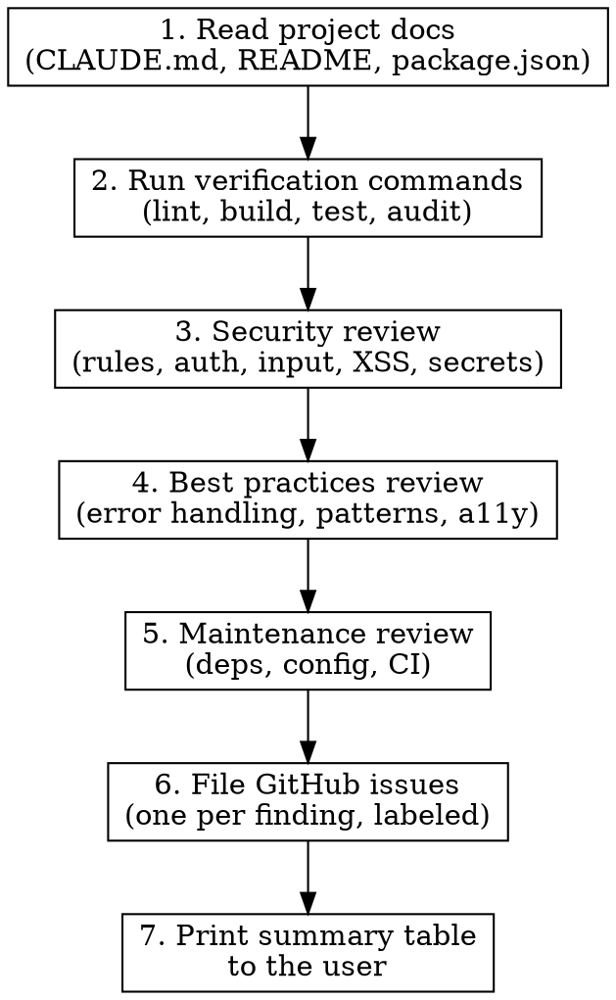

# Codebase Health Audit

## Overview

Systematic audit of a web application codebase. Produces GitHub issues filed directly to the repo, labeled by severity and category. Designed for React + Firebase + Vite stacks but adaptable.

**Core principle:** Verify before reporting. Every finding must be backed by evidence from actual command output or specific code references. Theoretical issues without proof get downgraded or dropped.

## Critical Rules

These rules are non-negotiable. Violating any of them invalidates the audit.

1. **NEVER expose secrets, API keys, credentials, or tokens in audit output.** Not in issue bodies, not in code examples, not in logs. Redact with `[REDACTED]` or `***`. This includes keys found in `.env` files, Firebase config, or anywhere else.
2. **Read CLAUDE.md, README, and project docs BEFORE auditing.** Understand deliberate design choices. Do not flag intentional tradeoffs as vulnerabilities without acknowledging the context.
3. **Run actual commands to verify findings.** Do not report issues based on code reading alone when a command can confirm or deny them.
4. **Respect project constraints.** If the project uses Firebase Spark (free) plan, do not recommend Cloud Functions or paid features. If the project deliberately avoids auth, do not recommend adding Firebase Auth. Recommendations must be actionable within the project's constraints.
5. **Do not give time estimates.** Focus on what needs fixing, not how long it might take.
6. **Do not recommend migrations** (e.g., "migrate to TypeScript") unless the project is already partially migrated or the user explicitly asks.

## Red Flags — STOP and Reconsider

If you find yourself doing any of these, stop:

- Pasting an actual API key or secret into your output
- Suggesting Cloud Functions for a project on Firebase Spark plan
- Flagging an intentional design choice as "Critical" without context
- Reporting a finding you haven't verified with a command or specific code reference
- Writing a markdown report instead of filing GitHub issues
- Giving time estimates or LOE predictions
- Suggesting a full rewrite or major migration

## Audit Process



### Step 1: Read Project Docs

Read these files first (if they exist):
- `CLAUDE.md` — architecture, constraints, deliberate choices
- `README.md` — setup, purpose, tech stack
- `package.json` — dependencies, scripts, engine requirements
- `firebase.json` / `firestore.rules` — hosting and security config
- Any `docs/` directory

**Document constraints you discover.** Examples:
- "Uses Firebase Spark (free) plan — no Cloud Functions"
- "No Firebase Auth — trusted-party model"
- "Client-side scoring to avoid backend"

These constraints shape every recommendation that follows.

### Step 2: Run Verification Commands

Run ALL of these before reviewing code. Capture output for evidence.

```bash
npm audit                    # Dependency vulnerabilities
npm run lint                 # Lint errors/warnings
npm run build                # Build health — does it compile?
npx vitest run               # Test health — do tests pass?
du -sh dist/                 # Bundle size check (after build)
npm outdated                 # Outdated dependencies
```

If any command fails, that failure IS a finding. File it.

### Step 3: Security Review

Check each area. For each finding, note the **specific file, line, and evidence**.

| Check | What to look for | How to verify |
|-------|-----------------|---------------|
| **Firestore rules** | Overly permissive read/write rules | Read `firestore.rules` — note which rules are open and whether that's intentional per project docs |
| **Secret exposure** | API keys, tokens, credentials in committed files | `grep -r "AIza\|sk-\|AKIA\|ghp_\|xox[bsp]-" --include="*.js" --include="*.jsx" --include="*.json" --include="*.html" src/` |
| **XSS vectors** | `dangerouslySetInnerHTML`, unescaped user input in DOM | `grep -r "dangerouslySetInnerHTML\|innerHTML" src/` — also check if user-provided strings (displayName, party name) are rendered safely |
| **Input validation** | Missing length limits, pattern validation, sanitization on form inputs | Review all `<input>` and `<textarea>` elements |
| **localStorage trust** | Reading localStorage without validation, trusting `isHost` flags | Check all `localStorage.getItem` calls — is the data validated? |
| **Auth model** | How host/admin access is controlled | Is the trust model appropriate for the use case? |
| **ID collisions** | Random ID generation without collision detection | Check `generateGuestId`, `generatePartyCode`, etc. |
| **Env config** | Missing `.env.example`, secrets in version control | Check `.gitignore` covers all env patterns; check if `.env.example` exists |
| **Hosting headers** | Missing CSP, X-Frame-Options, etc. in hosting config | Review `firebase.json` headers section |

**IMPORTANT:** When reporting Firestore rules findings for a project that intentionally uses open rules (e.g., trusted-party model), frame the finding as: "These rules are intentionally open per the project's trust model. If the threat model changes, here's what to tighten." Severity: Medium (not Critical).

### Step 4: Best Practices Review

| Check | What to look for |
|-------|-----------------|
| **Error boundaries** | Does the React app have error boundaries? One unhandled throw = white screen |
| **Error handling in async ops** | Are Firebase write operations wrapped in try/catch? Do users see error feedback? |
| **Hook error callbacks** | Do `onSnapshot` listeners have error callbacks? |
| **Loading states** | Do pages show loading indicators while data fetches? |
| **React patterns** | Missing keys in lists, unnecessary re-renders, stale closures |
| **Accessibility** | Missing `aria-label`, form labels, color contrast, keyboard navigation |
| **Offline behavior** | What happens when the network drops? Is Firestore persistence enabled? |

### Step 5: Maintenance Review

| Check | What to look for |
|-------|-----------------|
| **Test coverage** | Which layers have tests? Which don't? (Don't demand 100% — focus on critical paths) |
| **Lint cleanliness** | Does `npm run lint` pass? Are there warnings? |
| **Build health** | Does `npm run build` succeed? Any warnings? |
| **Dependency freshness** | `npm outdated` — focus on security-relevant updates, not chasing latest versions |
| **CI/CD** | Is there automated testing/deployment? |
| **Documentation** | Is there a `.env.example`? Are setup steps documented? |

### Step 6: File GitHub Issues

**One issue per finding. Do NOT write a lengthy report — the issues ARE the report.** Save narrative for the summary in Step 7.

**Filing method: write each issue body to a temp file, then pass it to `gh`.** This avoids heredoc escaping problems (backticks, quotes, and special characters inside heredocs cause syntax errors). Do NOT batch issues into a shell script — file them one at a time.

For each finding:

1. Write the issue body to a temp file using the Write tool (not a heredoc):

```
/tmp/audit-issue-N.md
```

with this structure:

```markdown
## Description

[What the issue is, with specific file paths and line numbers]

## Evidence

[Command output, code snippets (WITH SECRETS REDACTED)]

## Impact

[What could go wrong — specific to THIS project]

## Recommended Fix

[Concrete, actionable fix that respects project constraints. Include code if helpful.]

## Context

[Project constraints or deliberate design choices that affect this recommendation]
```

2. File the issue using the temp file as the body:

```bash
gh issue create \
  --title "[Severity] Short description" \
  --label "severity:high,category:security" \
  --body-file /tmp/audit-issue-N.md
```

3. Delete the temp file after filing.

**IMPORTANT: If `gh` commands are blocked by permissions**, stop and tell the user. Print the exact commands they need to run. Do NOT try to work around permission blocks by writing batch scripts or retrying the same blocked command.

**Labels to create** (create these first if they don't exist — use `|| true` in case they already exist):

```bash
gh label create "severity:critical" --color "B60205" --description "Must fix before production" || true
gh label create "severity:high" --color "D93F0B" --description "Should fix soon" || true
gh label create "severity:medium" --color "FBCA04" --description "Fix when convenient" || true
gh label create "severity:low" --color "0E8A16" --description "Nice to have" || true
gh label create "category:security" --color "5319E7" --description "Security vulnerability" || true
gh label create "category:best-practice" --color "1D76DB" --description "Best practice violation" || true
gh label create "category:maintenance" --color "006B75" --description "Maintenance or health issue" || true
gh label create "category:accessibility" --color "D4C5F9" --description "Accessibility issue" || true
```

**Severity classification:**
- **Critical:** Exploitable security vulnerability, data loss risk, or broken functionality
- **High:** Security concern that requires specific conditions to exploit, or missing safety net (error boundaries, validation)
- **Medium:** Best practice violation that degrades quality or developer experience
- **Low:** Improvement that would be nice but isn't causing problems

### Step 7: Print Summary

After filing all issues, print a summary table to the user:

```
## Audit Complete

| Severity | Count | Issues |
|----------|-------|--------|
| Critical | N     | #1, #2 |
| High     | N     | #3, #4 |
| Medium   | N     | #5, #6 |
| Low      | N     | #7     |

### Positive Findings
- [Things the codebase does well]

### Key Constraint Acknowledgments
- [Deliberate design choices that shaped recommendations]
```

## Common Mistakes

| Mistake | Correction |
|---------|-----------|
| Exposing API keys in audit output | ALWAYS redact. Use `[REDACTED]` or `***` |
| Flagging intentional design choices as Critical | Read project docs first. Acknowledge context in the finding |
| Reporting findings without running commands | Run lint, build, test, audit FIRST. Attach evidence |
| Recommending paid features for free-tier projects | Check project constraints before recommending |
| Writing a markdown report instead of GitHub issues | File individual issues with `gh issue create` |
| Suggesting TypeScript migration or major rewrites | Stay within the project's current stack unless asked |
| Generic "add input validation" without specifics | Point to exact files, lines, and missing validations |
| Giving time estimates | Never. Focus on what, not how long |
| Using heredocs for issue bodies with code snippets | Backticks and special chars break heredoc escaping. Write body to a temp file, use `--body-file` |
| Batching issues into a shell script | File issues one at a time with `gh issue create`. Scripts introduce escaping layers that break |
| Retrying blocked `gh` commands | If permissions block `gh`, stop and tell the user. Don't retry or write workaround scripts |
