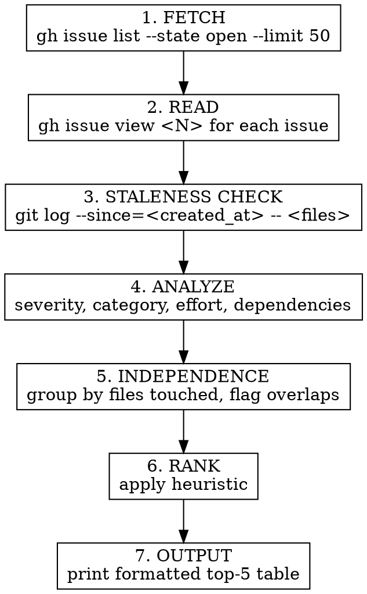

# Issue Triage

## Overview

Evaluate open GitHub issues against the **current** codebase state and output a prioritized top-5 summary. Issues may be stale — code changes since filing can resolve or alter them. Labels are a starting point, not gospel.

**Core principle:** Cross-reference every issue with `git log` before ranking. An issue flagged "high severity" three months ago may already be fixed.

## Critical Rules

1. **Triage only.** Never start working on an issue. Output the ranking and stop.
2. **Always fetch fresh data.** Run `gh issue list` and `gh issue view` every time — never rely on memory or cached results.
3. **Check staleness.** Every issue gets a `git log` cross-reference before ranking.
4. **Top 5 only.** Don't overwhelm with the full list. Summarize the rest in one line.
5. **Respect labels as input, not truth.** Labels inform severity but the issue body and codebase state determine the final ranking.

## Process



### Step 1: Fetch open issues

```bash
gh issue list --repo kzbigboss/OscarsPartyVotingApp --state open --limit 50 --json number,title,labels,createdAt
```

### Step 2: Read each issue

```bash
gh issue view <N> --repo kzbigboss/OscarsPartyVotingApp
```

Read the full body. Extract: files mentioned, code snippets referenced, related issue numbers, and any acceptance criteria.

### Step 3: Staleness check

For each issue, extract file paths or code patterns mentioned in the body. Then:

```bash
git log --oneline --since=<issue_created_at> -- <file_path>
```

Flag each issue as:

| Status | Meaning |
|--------|---------|
| **Still relevant** | No commits touched referenced files since issue creation |
| **Possibly resolved** | Commits touched referenced files — may already be fixed |
| **Needs verification** | Issue references code patterns but no specific files — can't determine automatically |

If the issue body doesn't mention specific files, check labels for clues (e.g., a `category:security` label on Firestore rules → check `firestore.rules`).

### Step 4: Analyze each issue

For each issue, determine:
- **Severity:** From labels (`severity:critical`, `severity:high`, `severity:medium`, `severity:low`). If no label, infer from body.
- **Category:** From labels (`category:security`, `category:best-practice`, `category:maintenance`). If no label, infer from body.
- **Effort:** Estimate from body complexity — `small` (< 1 hour), `medium` (1-4 hours), `large` (4+ hours).
- **Dependencies:** Does the issue reference other issues or share files with other issues?

### Step 5: Independence analysis

Group issues by the files they would likely touch. Issues that share files are dependent — they may conflict if worked in parallel. Flag each as:
- **Independent** — no file overlap with other open issues
- **Dependent** — shares files with issue #N

### Step 6: Rank using heuristic

| Priority | Criteria |
|----------|----------|
| 1 | High severity + security |
| 2 | High severity + maintenance |
| 3 | Medium severity: security > best-practice > maintenance |
| 4 | Low severity |
| **Tiebreaker** | Lower effort wins (quick wins first) |
| **Demotion** | "Possibly resolved" issues drop one tier |

### Step 7: Output

Print this exact format:

```
## Issue Triage — <date>

| # | Priority | Issue | Severity | Effort | Independent? | Staleness |
|---|----------|-------|----------|--------|--------------|-----------|
| 1 | P1       | #N — Title | high/security | small | ✅ | Still relevant |
| 2 | P2       | #N — Title | high/maint    | medium | ❌ (shares files with #M) | Possibly resolved |
| ...

### Independence Analysis

[Paragraph explaining which issues can be worked in parallel and which share files.]

### Remaining Issues

[Count] other open issues not in top 5. [One sentence summary of what they cover.]
```

## Common Mistakes

| Mistake | Correction |
|---------|-----------|
| Starting to work on an issue after triaging | This skill is triage only. Stop after printing the table. |
| Skipping staleness check for issues with no file references | Check labels for clues about which files to inspect. Flag as "Needs verification" if still unclear. |
| Ranking by labels alone without reading issue bodies | Labels are input, not truth. Read the body for actual severity and effort. |
| Listing all issues instead of top 5 | Top 5 only. Summarize the rest in one line. |
| Caching issue data across sessions | Always fetch fresh. Issues get closed, labels change, code evolves. |
| Fetching issues without `--json` flag in list step | Use `--json` for structured data in the list step. Use plain `gh issue view` for full body. |
